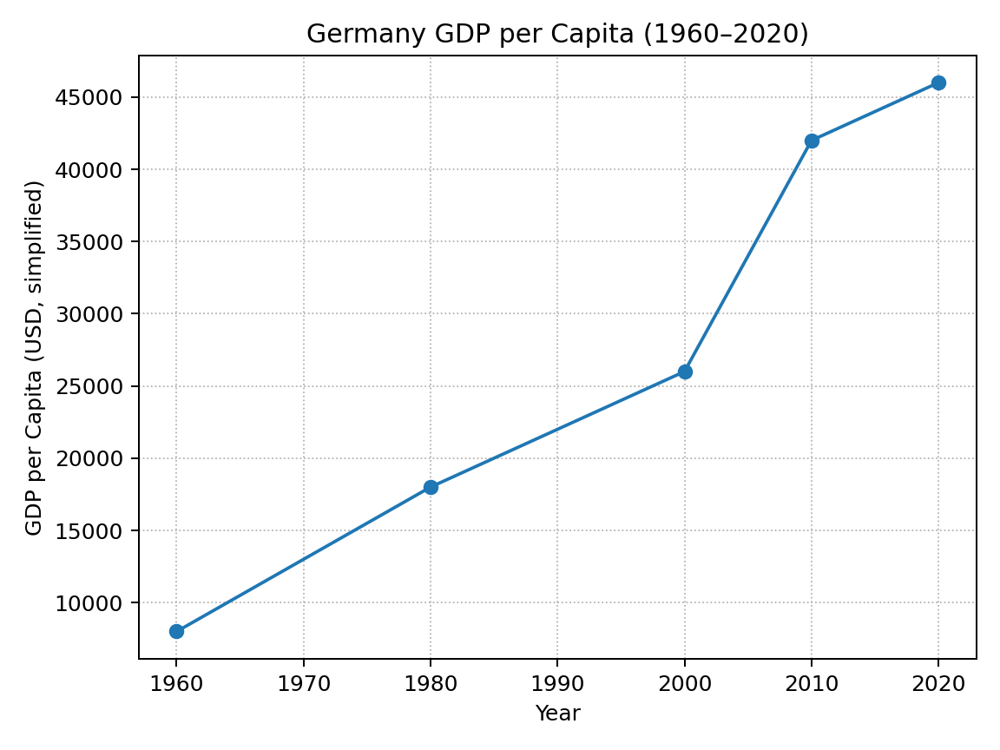
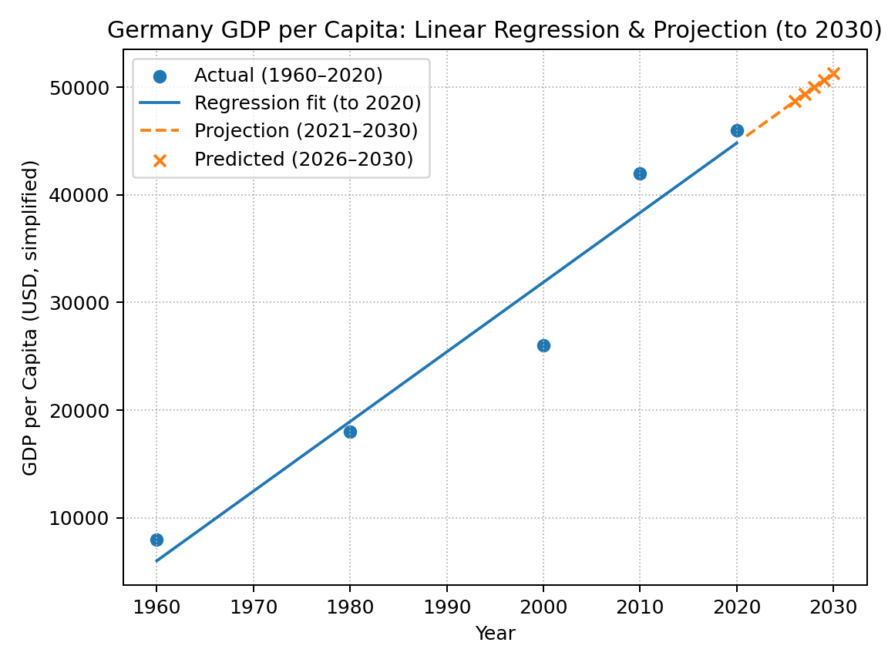

# 🇩🇪 Germany GDP Per Capita – Linear Regression (1960–2030)

This project analyzes **historical GDP per capita data for Germany** and applies a simple **linear regression model** to forecast values up to **2030**.  
It’s a lightweight data science project that demonstrates how to **explore data**, **fit a model**, and **visualize economic trends**.




---

## 📂 Project Structure

```
.
├── data/
│   ├── germany_percapita_income.csv            # Full simplified dataset (1820–2020)
│   ├── germany_gdp_percapita_after_1960.csv    # Filtered dataset (≥ 1960)
│   └── predictions_2026_2030.csv               # Linear regression forecasts
├── figures/
│   ├── germany_gdp_trend.png                   # Historical GDP per capita plot
│   └── germany_gdp_prediction.png             # Regression projection plot
├── notebooks/
│   ├── germany_gdp.ipynb
│   └── germany_gdp_prediction.ipynb
├── src/
│   └── train_and_predict.py                    # Script for training and predictions
├── requirements.txt
└── README.md
```

---

## 🚀 Quickstart

Follow these steps to set up and run the project locally:

```bash
# 1️⃣ Clone the repository
git clone https://github.com/<your-username>/germany-gdp-regression.git
cd germany-gdp-regression

# 2️⃣ Create and activate a virtual environment
python -m venv .venv
source .venv/bin/activate        # Windows: .venv\Scripts\activate

# 3️⃣ Install dependencies
pip install -r requirements.txt

# 4️⃣ Run the analysis (option 1 — Notebook)
jupyter notebook notebooks/germany_gdp_prediction.ipynb

# 4️⃣ Run the analysis (option 2 — Script)
python src/train_and_predict.py
```

---

## 📊 Results

The linear regression model is trained on **Germany’s GDP per capita data (1960–2020)** and used to predict future values.  
Below are the **forecasted values for 2026–2030**:

| Year | Predicted GDP per Capita (USD) |
|------|-------------------------------:|
| 2026 | 48,690 |
| 2027 | 49,336 |
| 2028 | 49,983 |
| 2029 | 50,629 |
| 2030 | 51,276 |

> 📝 *These values are based on a simple linear model and are for illustrative purposes only.*

---

## ✨ Features

- 📈 Historical data visualization (1960–2020)  
- 🧮 Linear regression modeling with scikit-learn  
- 🔮 Forecasting GDP per capita up to 2030  
- 🖼️ Exported charts for use in README and reports  
- 📝 Reproducible analysis via notebooks or a Python script

---

## 🛠️ Technologies Used

- **Python 3**  
- **pandas**, **NumPy** — data manipulation  
- **Matplotlib** — visualization  
- **scikit-learn** — linear regression  
- **Jupyter Notebook** — exploratory analysis

---

## ⚠️ Disclaimer

This is a **basic educational project**.  
The forecasts are **illustrative only** and do not account for complex economic factors, external shocks, or nonlinear trends.  

---

## 🏷️ Topics

`linear-regression` · `data-analysis` · `forecasting` · `python` · `gdp` · `economics` · `machine-learning`

---

## 🌟 Acknowledgements

- GDP per capita data is **simplified** for demonstration purposes.  
- Inspired by beginner-friendly data science regression projects.

---

### ✅ Pro Tip

📌 **Pin this repository** on your GitHub profile to make it stand out.  
🖼️ Add a **social preview image** (e.g. your regression plot) in the repo settings for a more polished look when sharing.

---

## 📄 License

MIT License © 2025 Your Name
